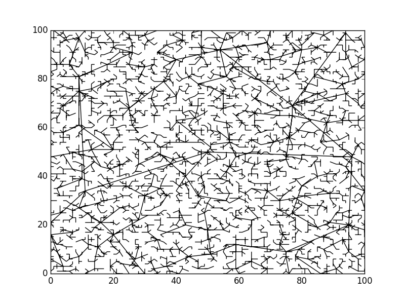
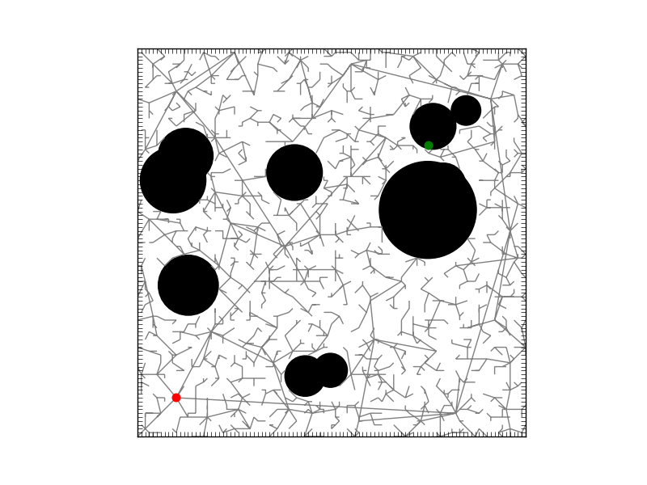

# Path Planning Basics

### RRT
The Rapidly-Exploring Random Tree (RRT) algorithm is used to quickly explore unknown spaces using a tree-shaped approach. Given a starting point - or configuration - as the root, the tree is incrementally grown by first picking a random new location, determining the closest known neighbor, and then adding the path towards the random location (or some portion of it) to the tree. Different step values determine how quickly the space is discovered relative to each exploration cycle. RRTs contain no loops, and every child has only one parent. A popular tool to use for robotic path planning, the RRT algorithm was developed by Dr. Steve LaValle in 1998. (Thanks Steve!)

## Basic RRT
[`rrt_basic.py`](rrt_basic.py) is the most bare bones implementation of an RRT. Nodes of the tree are stored as **vertexes** and branches are stored as **edges**. If a random configuration has already been generated before, it is skipped. Once the algorithm has been run for the desired number of trials, the tree is plotted in a `matplotlib` figure. The images below show the RRT running for 50, 500, and 5000 trials, respectively.

 

## Path Planning with Collision Objects
[`rrt_circle.py`](rrt_circle.py) attempts to find a path to a goal configuration starting from a specified initial configuration. Random circles are generated on the field as collision objects that the algorithm must avoid. If a path is found, the correct path and all other previous explored branches are plotted. If it cannot find a path after a specified number of trials, the program terminates, showing the tree it used to find the goal. Below are two examples of a successful and an unsuccessful RRT.

Collisions were detected using vector geometry. Let's assume *p1* is the most recent known vertex and *p2* is the new randomly generated configuration. We want to know if the line segment created by these points falls within the boundaries of any of the randomly generated circles of radius *r*. If we use *t* as a simple scalar, we can represent any point on the line segment with the following equation: *px = p1 + t(p2 - p1)*. We also know that any point on this line is considered on or within the boundary of a circle if the distance between that point and the center of the circle *q* is less than or equal to *r*, giving us the equation: *|x - q| = r*. Using this information and properties of dot products, we can derive a quadratic equation that represents the intersection points of this line segment, if there are any. If a solution to this equation is between 0 and 1, there is a collision and this random configuration point is not added to the tree.

## Path Planning with Arbitrary Shapes
Using a bitmap image, we can construct any kind of environment to move around in. [`rrt_bitmap.py`](rrt_bitmap.py) reads an image using `imread`, converts it to a bitmap array, and then runs the same RRT as the circle collision code in the method above. The only difference is that the `open_path()` function needs to see of the line segment created by *p1* and *p2* crosses over any "collision pixels" which can be determined in the bitmap array with either a 0 or 1. To start, the same equation from the above method is used to generate any point along the line segment: *px = p1 + t(p2 - p1)*. From t = 0 to t = 1, we can calculate which pixel values are approximately on this line by rounding all *px* values to integers. Using an arbitrary increment for t (this code uses .01), a rasterized version of the line segment is then generated. Now, looking for a collision is simple. All we need to do is see if any of the points in the rasterized line are marked as a "collision pixel" in our bitmap array. If no match is found, there is a clear path to *p2*. Below are two examples of a successful and an unsuccessful RRT.

